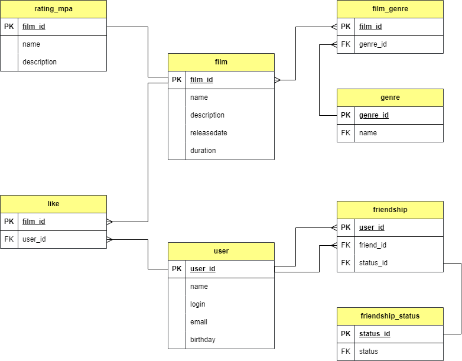

# java-filmorate
Сервис, имеющий функционал работы с пользователями и фильмами

###  Описание функционала

* добавление пользователя
* обновление данных о пользователе
* получение списка всех пользователей
* создание фильма
* обновление данных о фильме
* получение списка всех фильмов
* получение каждого фильма и данных о пользователях по их уникальному идентификатору
* добавление или удаление друга у пользователя
* вывод списока друзей пользователя
* вывод списока друзей, общих с другим пользователем
* добавление или удаление лайка у фильма
* вывод списока из первых фильмов по количеству лайков

### Модель схемы базы данных сервиса



### Пояснение к сведениям, указанных на схеме

* film: содержит данные о фильме
* user: содержит данные о пользователе
* film_genre: связующее звено между идентификаторами фильма и жанров
* genre: у фильма может быть сразу несколько жанров, а у поля — несколько значений.
* film_rating: связующее звено между идентификаторами фильма и рейтинга
* rating: рейтинг Ассоциации кинокомпаний, эта оценка определяет возрастное ограничение для фильма
* like: таблица лайков пользователей в разрезе фильмов
* friendship: содержит данные о друзьях пользователя
* friendship_status: : содержит данные о статусе дружбы (неподтверждённая, подтвержденная)

### Примеры SQL-запросов
Получить User по id:
```roomsql
SELECT *
FROM user 
WHERE user_id = 1;
```
Вывести id неподтвержденных друзей User c id = 1:
```roomsql
SELECT f.name, fr.friend_user_id
FROM film AS f
RIGHT JOIN friendship AS fr ON f.user_id = fr.user_id
RIGHT JOIN friend_status AS fs ON fr.friend_status_id = fs.friend_status_id
WHERE fs.status = 'unconfirmed' ;
```
Получить список пяти Films:
```roomsql
SELECT *
FROM films 
LIMIT 5;
```
Получить все названия Films, рейтинг которых PG:
```roomsql
SELECT f.name
FROM film AS f
RIGHT JOIN film_rating AS fr ON f.film_id = fr.film_id
RIGHT JOIN rating AS r ON r.rating_id = fr.rating_id
WHERE r.name = 'PG';
```
Получить Films, жанр которых "Мультфильм":
```roomsql
SELECT f.name
FROM film AS f
RIGHT JOIN genre_films AS gf ON f.film_id = gf.film_id
RIGHT JOIN genre AS g ON g.genre_id = gf.genre_id
WHERE g.name = 'cartoon';
```